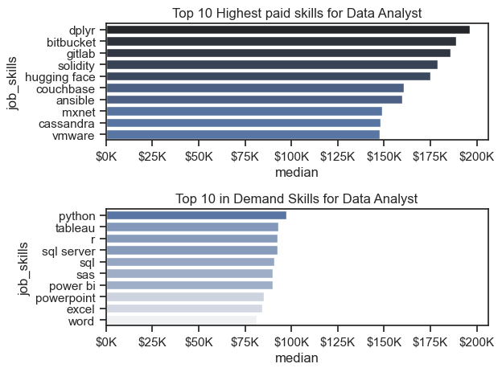

# Introduction

This project explores the most in-demand and high-paying skills for data analysts in the US job market.The data has been sourced from `Luke Barousse's Python Course`. It analyzes job postings, salary trends, and skill demand to provide insights into the best skills to learn for career growth. By leveraging data visualization and statistical analysis, this study aims to help aspiring data analysts make informed decisions about skill development.

# Background

The analysis focuses on answering the following key questions:

1. What are the most demanded skills for the top 3 most popular data roles?
2. How are in-demand skills trending for Data Analysts?
3. How well do jobs and skills pay for Data Analysts?
4. What are the most optimal skills to learn for Data Analysts?(High Demand and High Paying)

# Tools Used
1. Python (Pandas, Matplotlib, Seaborn, AdjustText)
2. Jupyter Notebook for exploratory analysis
3. Matplotlib & Seaborn for data visualization
4. GitHub for version control
5. VS Code for executing python scripts

# The Analysis

## 1. What are the most demanded skills for the top 3 most popular data roles?

To find the most demanded skills for the top 3 most popular data roles I filtered out those position which ones were the most popular and get the top 5 skills for top 3 roles. This query highlight the most popular job titles and their top skills, showing which skills should I pay attention to depending on the role I am targeting.

View my notebook with detailed steps here:
[2_Skill_Demand.ipynb](3_Project/2_Skill_Demand.ipynb)

## Visualise Data

```python
fig, ax=plt.subplots(len(job_titles), 1)
for i, job_title in enumerate(job_titles):
    df_plot=df_skill_percent[df_skill_percent['job_title_short']==job_title].head(5)
    ##df_plot.plot(kind='barh', x='job_skills', y='skill_percent', ax=ax[i], title=job_title)
    sns.barplot(data=df_plot, x='skill_percent', y='job_skills', ax=ax[i], hue='skill_count', palette="dark:b_r")
    ax[i].set_title(job_title)
    ax[i].set_ylabel('')
    ax[i].set_xlabel('')
    ax[i].get_legend().remove()
    ax[i].set_xlim(0,78)
    for(n, v) in enumerate(df_plot['skill_percent']):
        ax[i].text(v+1, n, f'{v:.0f}%', va='center')
    if i!=len(job_titles):
        ax[i].set_xticks([])
fig.suptitle('Likelihood of Skills Requested in US Job Posting', fontsize=15)
plt.tight_layout(h_pad=0.5)
plt.show()
```
### Results


### Insights

Based on the given bar chart data for the likelihood of skills requested in U.S. job postings for Data Analyst, Data Engineer, and Senior Data Engineer roles, here are some insights:

### 1. Key Skills by Role:
### Data Analyst:
SQL is the most in-demand skill (51%), highlighting its critical role in querying and managing data.
Excel follows at 41%, emphasizing the continued relevance of spreadsheet tools in data analysis.
Tableau (28%) and Python (27%) indicate a growing demand for visualization and programming skills, while SAS is less common (19%).
### Data Engineer:
SQL (68%) and Python (65%) dominate as essential skills, crucial for handling data pipelines and ETL processes.
AWS (43%) reflects the increasing reliance on cloud platforms in data engineering.
Azure and Spark (both 32%) point to additional cloud and big data tools often required in this role.
### Senior Data Engineer:
Python and SQL are equally prioritized (72%), underlining the advanced level of technical expertise required.
AWS (52%) remains significant, indicating the need for cloud infrastructure proficiency.
Spark (42%) and Azure (37%) show growing importance in big data and cloud-based engineering.

### 2. Role-Wise Comparisons:
### Programming Skills (Python):
Python becomes increasingly critical as roles progress from Data Analyst (27%) to Senior Data Engineer (72%).

### SQL Usage:
SQL remains consistently important across all roles, from Data Analyst (51%) to Senior Data Engineer (72%).

### Cloud and Big Data Skills:
AWS is more relevant for engineering roles, with increasing demand for Senior Data Engineers (52%).
Spark and Azure gain prominence in Data Engineer and Senior Data Engineer roles but are less important for Data Analysts.
### 3. Trend Analysis:
Shift Toward Technical Specialization:
Data Analysts primarily rely on foundational tools like SQL and Excel, while Data Engineers and Senior Data Engineers require advanced technical skills, including cloud platforms and programming languages.
Cloud Technologies:
Demand for AWS, Azure, and Spark increases significantly in engineering roles, reflecting industry trends in cloud adoption and big data processing.
Visualization Tools:
Tableau appears only for Data Analysts, suggesting that visualization is less critical for engineering-focused roles.

### 4. Skill Growth Opportunities:
Aspiring professionals should focus on SQL and Python as core skills for all data-related roles.
Cloud certifications (AWS, Azure) and big data frameworks (Spark) are valuable for engineering roles.
For Data Analysts, acquiring proficiency in Tableau and Excel can enhance employability.

### 2 How are in demand skills trending for Data Analyst?

### Visualise Data
```python
df_DA_US_percent=df_DA_US_percent.iloc[:, :5]
sns.lineplot(data=df_DA_US_percent, dashes=False, palette='tab10')
sns.set_theme(style='ticks')
sns.despine()
plt.title('Trending Top Skills For Data Analyst in US')
plt.ylabel('Likelihood in Job Posting')
plt.xlabel('2023')
plt.tight_layout()
from matplotlib.ticker import PercentFormatter
ax=plt.gca()
ax=ax.yaxis.set_major_formatter(PercentFormatter(decimals=0))
```
### Results


### Insights
Based on the graph, here are concise insights:

SQL: Consistently the most in-demand skill, maintaining a high likelihood (around 50-55%) in job postings throughout the year.

Excel: The second most prominent skill, showing steady demand (40-45%) but declining slightly toward the end of the year.

Tableau: Moderate demand, with slight fluctuations, peaking around August and gradually declining afterward.

Python: Stable but slightly lower demand than Tableau, peaking around mid-year.

SAS: The least demanded skill among the five, showing steady demand (around 15-20%) throughout the year.

Key Takeaway
Focusing on SQL and Excel remains crucial, while Tableau and Python are valuable complementary skills for aspiring data analysts. SAS is less emphasized.


### 4 How well do jobs and skills pay for Data Analysts?

### Salary Analysis of Data Nerds

### Visualising Data

```python
sns.boxplot(data=df_US_top6, x='salary_year_avg', y='job_title_short', order=job_order)
sns.set_theme(style='ticks')
plt.title('Salary Distribution in the United States')
plt.xlabel('Yearly Salary (USD)')
plt.ylabel('')
plt.xlim(0, 600000)
ticks_x=plt.FuncFormatter(lambda y, pos: f'${int(y/1000)}K')
plt.gca().xaxis.set_major_formatter(ticks_x)
plt.show()
```

### Results


### Insights

### Here are key insights based on the salary distribution graph:

### Senior Roles Dominate Higher Salaries:

Senior Data Scientist and Senior Data Engineer have the highest median salaries, with their ranges extending up to $500K or more, highlighting significant earning potential in these roles.

### Data Scientists vs. Data Engineers:

Data Scientists and Data Engineers have similar salary distributions, with medians lower than senior roles but higher than data analysts. Their upper range approaches $300K-$400K.

### Data Analyst Roles:

Senior Data Analysts earn noticeably more than regular Data Analysts, with a wider interquartile range and a few outliers exceeding $200K.
Data Analysts have the lowest salary distribution, with most salaries below $100K, making it the starting point for entry-level professionals.

### Outliers Indicate High Earning Opportunities:

Across all roles, some outliers suggest rare but very high-paying positions, particularly in senior-level roles.
Key Takeaway:
Senior positions offer significantly higher salaries, emphasizing the value of experience and specialization. Entry-level data analysts can aim to progress into senior roles or pivot to data science or engineering for increased earning potential.

### Highest Pay and Most Demanded Skills for Data
```python
fig, ax=plt.subplots(2,1)
sns.set_theme(style='ticks')
##df_DA_US_toppay[::-1].plot(kind='barh', y='median', ax=ax[0], legend=False)
sns.barplot(data=df_DA_US_toppay, x='median', y=df_DA_US_toppay.index, ax=ax[0], hue='median', palette='dark:b_r', legend=False)

ax[0].set_title('Top 10 Highest paid skills for Data Analyst')
ax[0].ylabel=''
ax[0].xlabel=''
ax[0].xaxis.set_major_formatter(plt.FuncFormatter(lambda x, pos: f'${int(x/1000)}K'))


##df_DA_US_topskill[::-1].plot(kind='barh', y='median', ax=ax[1], legend=False)

sns.barplot(data=df_DA_US_topskill, x='median', y=df_DA_US_topskill.index, ax=ax[1], hue='median', palette='light:b', legend=False)
ax[1].set_title('Top 10 in Demand Skills for Data Analyst')
ax[1].ylabel=''
ax[1].xlabel='Median Salary in USD'
ax[1].set_xlim(ax[0].get_xlim())
ax[1].xaxis.set_major_formatter(plt.FuncFormatter(lambda x, pos: f'${int(x/1000)}K'))
plt.tight_layout()
```
### Results

*Two seperate bar graph visualising the highest paid skills and most in demand skills for Data Analyst in US.*

### Insights

The top graph shows `dplyr`, `bitbucket` and `gitlab` are assosciated with higher salaries with some of them reaching to $200K, indicating that advanced technical proficiency can increase earning potential. 

The bottom graph shows that `python`, `tableau` and `sql` does not indicate high earning potential as compared to the top graph but they are most in demand skills. These skills are important for data analyst roles.

Thus data analyst aspirants should look for polishing in demand skills as well as the skills which have higher earning potential.

### 4. what is the most optimal skills to learn for Data Analysts?
```python
# Plotting
sns.scatterplot(
    data=df_plot,
    x='skill_percent',
    y='median_salary',
    hue='technology'
)
sns.despine()
sns.set_theme(style='ticks')
texts=[]
from matplotlib.ticker import PercentFormatter
for i, txt in enumerate(df_DA_skills_lim.index):
    texts.append(plt.text(df_DA_skills_lim['skill_percent'].iloc[i], df_DA_skills_lim['median_salary'].iloc[i], txt, va='top'))
# adjust text to overlap
adjust_text(
    texts, 
    arrowprops=dict(arrowstyle='->', color='gray'),
    expand_points=(1.2, 1.5),  # Spacing from points
    expand_text=(1.2, 1.5),    # Spacing between labels
    force_text=(0.05, 0.3),    # Push overlapping labels apart
)
plt.xlabel('Skill Percent')
plt.ylabel('Median Yearly Salary')
plt.title('Most Optimal Sills for Data Analyst in US')
ax=plt.gca()
ax=ax.yaxis.set_major_formatter(plt.FuncFormatter(lambda y, pos: f'${int(y/1000)}K'))
ax=plt.gca()
ax=ax.xaxis.set_major_formatter(PercentFormatter(decimals=0))
plt.tight_layout()
plt.show()
```

*A scatter plot visualizing the most optimal skills (high paying and high demand) for Data Analysts in the US.*

### Insights
Concise Insights from the Graph
SQL and Python are the Most Valuable

SQL (55%) is the most in-demand skill, followed by Python (30%), both offering high median salaries (~$92K+).
Excel and Power BI are Essential Analyst Tools

While Excel (40%) and Power BI (25%) are frequently required, they have lower salaries compared to programming and database skills.
Databases Like SQL Server and Oracle Pay Well

SQL Server and Oracle offer high median salaries (~$92K+), making database expertise highly lucrative.
Cloud Skills (Oracle) Have the Highest Salary Potential

Oracle ($97K) highlights the growing demand for cloud-based database management skills.

# What I learned?

Through this analysis, I gained hands-on experience in data preprocessing, visualization, and insight extraction. I learned how different job roles prioritize skills, the salary impact of technical expertise, and the trends in skill demand. Additionally, I refined my ability to communicate findings effectively through visual storytelling.

# Key Insights

1. SQL and Python are the most essential skills, consistently in demand across data roles and offering strong salary prospects (~$92K+).
2. Cloud and database skills (Oracle, SQL Server) yield the highest salaries, making them valuable for career progression.
3. Visualization tools like Tableau and Power BI are crucial for Data Analysts but offer lower salary potential compared to programming and database skills.
4. Data Engineers and Senior Data Engineers require specialized technical expertise, including AWS, Spark, and Azure, which increase earning potential.
5. Job market trends show a shift toward cloud and big data technologies, emphasizing the importance of upskilling in these areas.

# Conclusion

This study provides valuable insights into the evolving landscape of data analytics careers. For aspiring data analysts, mastering SQL, Python, and cloud technologies is crucial for securing high-paying opportunities. By balancing in-demand skills with high-paying expertise, professionals can optimize their career growth and earning potential in the competitive data industry.